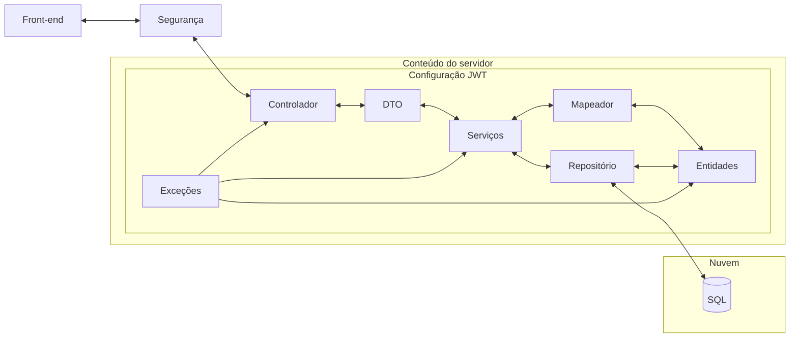

# 25_2-CaccoID

**Título do TCC:**
**CaccoID: Sistema Online de Emissão de Carteirinhas Estudantis**

**Alunos:**

* Larissa Coelho Ramos
* Nicolas Anderson de Almeida Oliveira Assis
* Rafael Pereira Barros Conceição

**Semestre de Defesa:**
2025-2

[PDF do TCC](https://github.com/EIC-BCC/25_2-CaccoID/blob/main/TCC_2_CACCO_ID.pdf)

---

# TL;DR

Sistema web para **solicitação, gestão e emissão de carteirinhas estudantis digitais e físicas**, desenvolvido para o curso de Bacharelado em Ciência da Computação do CEFET/RJ.

Para rodar a aplicação localmente:

Basta configurar os arquivos .env.example na pasta caccoid-front, e caccoId e renomear para .env .

E rodar o seguinte comando no terminal:

```bash
docker compose up --build
```

---

# Descrição Geral

O **CaccoID** é um sistema informatizado desenvolvido para modernizar e automatizar o processo de solicitação e emissão de carteirinhas estudantis do curso de Bacharelado em Ciência da Computação do CEFET/RJ, atendendo às demandas do Centro Acadêmico de Ciência da Computação (CACCO).

O sistema substitui uma solução anterior baseada em formulários genéricos, oferecendo maior **transparência, rastreabilidade, automação e usabilidade**. A plataforma permite que os estudantes acompanhem o status da solicitação em tempo real, recebam notificações automáticas por e-mail, realizem correções quando necessário e escolham entre a emissão de carteirinhas **digitais (com QR Code)** e **físicas**.

O projeto está alinhado aos princípios de **transformação digital**, **sustentabilidade** e **usabilidade**, promovendo a redução do uso de documentos físicos e facilitando a verificação da autenticidade da carteirinha por meio de QR Code, conforme a legislação vigente.

---

## Funcionalidades

### Autenticação e Conta

* Cadastro de usuários.
* Login e logout.
* Controle de acesso por perfil.
* Recuperação e alteração de senha.
* Autenticação baseada em token (JWT).

---

### Solicitação de Carteirinha

* Preenchimento de dados pessoais e acadêmicos.
* Envio de documentos e foto.
* Solicitação de carteirinha digital e/ou física.
* Validações automáticas de elegibilidade.
* Registro e controle da solicitação.

---

### Correção e Reenvio

* Solicitação de correções pelo administrador.
* Edição de dados e reenvio de documentos.
* Atualização do status da solicitação.

---

### Análise e Gestão

* Visualização e análise de solicitações.
* Aprovação ou reprovação.
* Controle do fluxo por estados.
* Gerenciamento administrativo das solicitações.

---

### Emissão de Carteirinha

* Emissão de carteirinha digital.
* Geração de QR Code para validação.
* Controle de validade e expiração.
* Gestão da carteirinha física (produção, envio e entrega).

---

### Visualização e Validação

* Visualização da carteirinha digital.
* Página de verificação de autenticidade via QR Code.
* Identificação de carteirinhas válidas ou expiradas.

---

### Acompanhamento e Notificações

* Acompanhamento do status da solicitação.
* Envio automático de e-mails para confirmação de email.

---

### Interface e Usabilidade

* Interface web responsiva.
* Experiência orientada ao fluxo da solicitação.
* Painel administrativo para gestão.

---

# Arquitetura

O sistema adota uma **arquitetura em camadas**, com separação clara de responsabilidades entre front-end, back-end e banco de dados. A comunicação ocorre por meio de uma **API RESTful stateless**, utilizando autenticação via JWT.



**Resumo da arquitetura:**

* Front-end em React
* Back-end em Java com Spring Boot
* Autenticação via JWT
* Banco de dados relacional MySQL
* Serviços containerizados com Docker
* Orquestração com Docker Compose

---

# Dependências

* Docker
* Docker Compose
* Java 23
* Spring Boot
* React 19
* Styled Components
* MySQL (via TiDB Cloud)
* Git

---

# Execução

## Pré-requisitos

* Docker instalado
* Docker Compose instalado

## Executando o projeto
Basta configurar os arquivos .env.example na pasta caccoid-front, e caccoId e renomear para .env .

E no diretório raiz do projeto, execute:

```bash
docker compose up --build
```

Esse comando irá:

* Construir as imagens do front-end e back-end
* Inicializar os containers necessários
* Subir todos os serviços de forma integrada

Após a inicialização, a aplicação estará disponível conforme as portas configuradas no `docker-compose.yml`.


